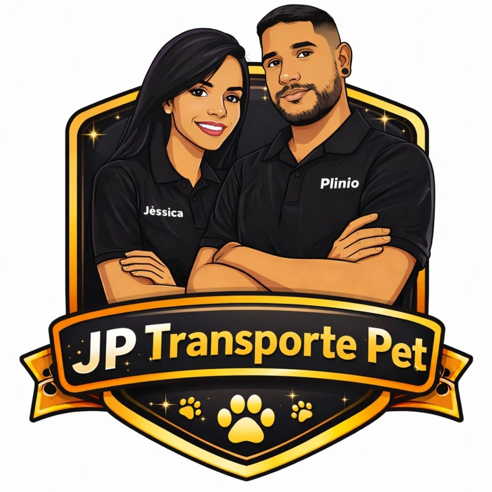
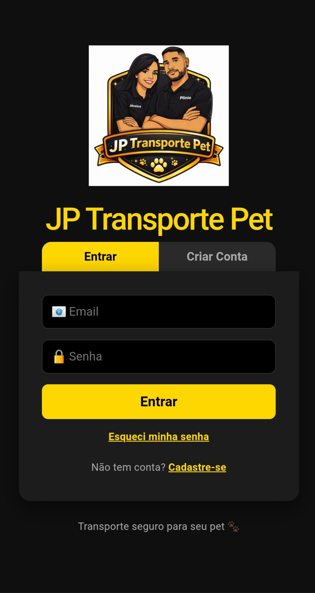
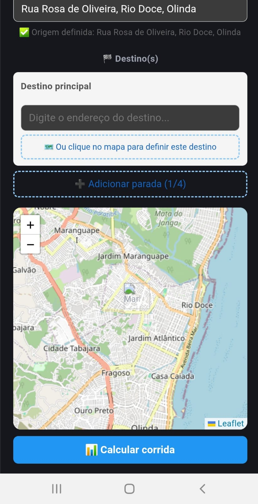
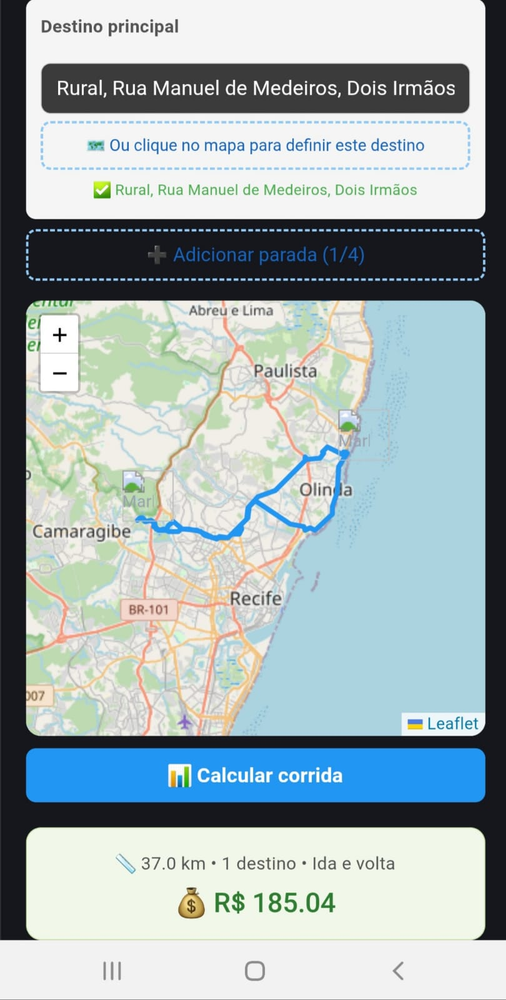

  

# 🐾 JP Transporte Pet

🚗 Aplicativo de transporte especializado para pets  
📍 Desenvolvido por Plínio Martins  

---

## 📱 Sobre o App

O **JP Transporte Pet** é um aplicativo que conecta tutores de pets a um serviço de transporte seguro, rápido e confiável.

---

## 🚀 Funcionalidades

- 📍 Mapa em tempo real
- 💰 Cálculo automático de corrida
- 🐕 Seleção de porte do pet
- 📲 Integração com WhatsApp
- 🔐 Sistema de login
- ☁️ Banco de dados (Firebase)

---

## ⚠️ Aviso

Este repositório é uma versão demonstrativa.  
Algumas funcionalidades foram desativadas por segurança.

---

## 🛠️ Tecnologias

- React
- Firebase
- JavaScript
- Capacitor (Android APK)

---

## 📸 Preview do App

---

## 📞 Contato

📱 WhatsApp: (81) 99832-7712 

---

🔥 Em breve disponível na Play Store!
